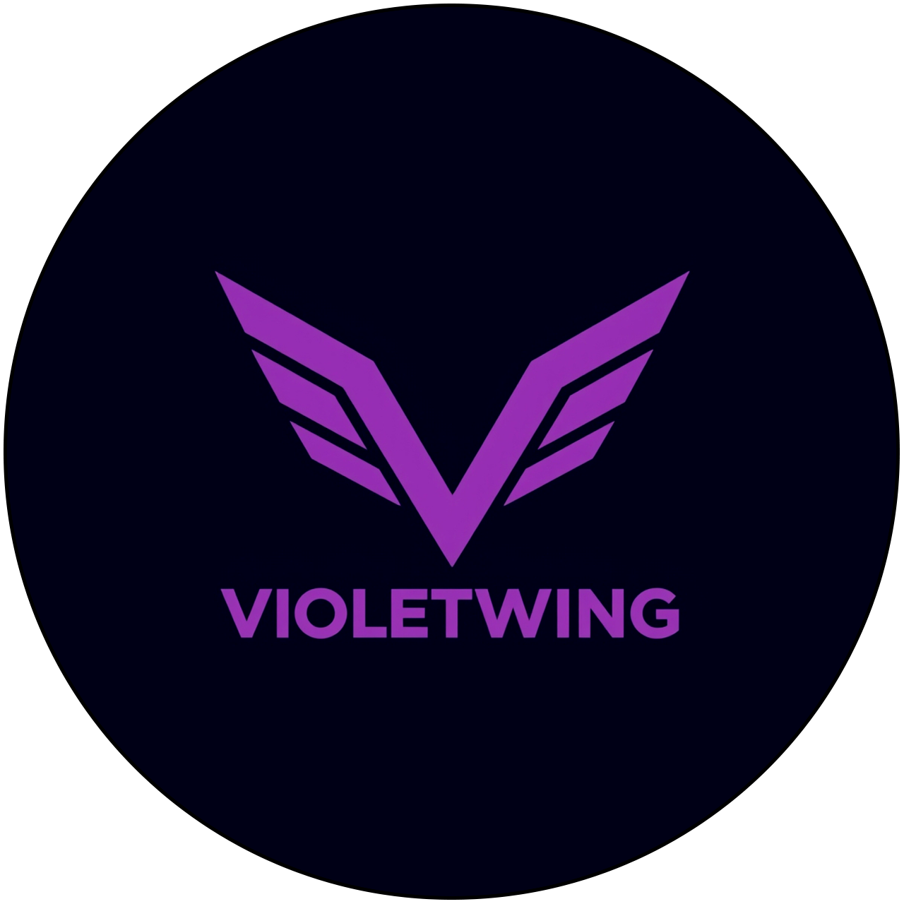

<div align="center">
   
   <h1>VioletWing</h1>
   <p>Your ultimate assistant for Counter-Strike 2</p>

[](https://github.com/Jesewe/VioletWing/releases)
[](https://github.com/Jesewe/VioletWing/releases/latest/)
[](LICENSE)

> [!IMPORTANT]
> **Project Discontinued**
>
> This project has reached its end of life. **v1.2.9.2** is the final release and no updates will be provided.

<a href="#-key-features"><strong>Features</strong></a> •
<a href="#-installation"><strong>Installation</strong></a> •
<a href="#-quick-start"><strong>Quick Start</strong></a> •
<a href="#-configuration"><strong>Configuration</strong></a> •
<a href="#-troubleshooting"><strong>Support</strong></a>

</div>

---

## 🌟 What is VioletWing?

VioletWing is a comprehensive training tool designed to help Counter-Strike 2 players analyze and improve their gameplay mechanics. Whether you're practicing aim consistency, movement techniques, or game awareness, VioletWing provides the tools you need to level up your skills.

---

## ✨ Key Features

### 🎯 TriggerBot

Precision training tool for developing muscle memory and reaction timing.

- **Customizable Trigger Keys**: Map to any key (`x`, `c`, `mouse4`, `mouse5`)
- **Toggle Mode**: Single-key activation for convenience
- **Weapon-Specific Delays**: Realistic timing for Pistols, Rifles, Snipers, SMGs, and Heavy weapons
- **Advanced Configuration**: Fine-tune `ShotDelayMin`, `ShotDelayMax`, and `PostShotDelay`

### 👁️ ESP Overlay

Visual training aid to understand positioning and game mechanics.

- **Enemy Detection**: Bounding boxes, skeletons, and snaplines
- **Health & Name Display**: Real-time player information
- **Customizable Appearance**: Colors, line thickness, and FPS targeting
- **Teammate Visualization**: Optional teammate drawing with name transliteration

### 🐰 Bunnyhop

Master movement mechanics with automated bunny hopping practice.

- **Configurable Jump Key**: Set your preferred key binding
- **Adjustable Timing**: Control jump delay for different scenarios
- **Speed Maintenance**: Learn optimal timing for speed retention

### 🕶️ NoFlash

Train without interruption from flashbang effects.

- **Adjustable Suppression**: Control flash reduction strength
- **Seamless Integration**: Maintains gameplay feel while reducing distractions

### 🖥️ Modern GUI

Intuitive interface for easy configuration and monitoring.

- **Dashboard**: Real-time status, offset updates, and version information
- **Settings Panels**: Dedicated tabs for General, Trigger, Overlay, and Additional settings
- **Live Logs**: Monitor bot activity with integrated log viewer
- **FAQ Section**: Built-in help for all features
- **Update Notifications**: Stay current with automatic update checking
- **Supporters Page**: Acknowledge community contributors

### ⚙️ Advanced Functionality

- **Automatic Offset Updates**: Fetches latest offsets from remote sources on startup
- **Dynamic Configuration**: Apply `config.json` changes without restarting
- **Comprehensive Logging**: Detailed logs saved to `%LOCALAPPDATA%\VioletWing\logs\`
- **Version Management**: Supports both stable and pre-release updates
- **File Watching**: Real-time config updates via file monitoring

---

## 📦 Installation

### Method 1: Download Pre-Built (Recommended)

**Easiest way to get started!**

1. Visit the [**Releases Page**](https://github.com/Jesewe/VioletWing/releases)
2. Download the latest `VioletWing.exe`
3. Run and enjoy!

### Method 2: Build from Source

**For developers and advanced users**

```bash
# Clone the repository
git clone https://github.com/Jesewe/VioletWing.git
cd VioletWing

# Install dependencies
pip install -r requirements.txt

# Install PyMeow (required for overlay rendering)
# Download from: https://github.com/qb-0/pyMeow/releases
pip install pyMeow*.zip

# Run the application
python main.py
```

**Optional: Create your own executable**

```bash
compile.bat
```

> **System Requirements:** Python >= 3.8 and < 3.12.10

---

## 🚀 Quick Start

1. **Launch Counter-Strike 2** and enter a practice match
2. **Start VioletWing** (executable or Python script)
3. **Configure Your Settings** using the intuitive GUI
4. **Toggle Features** on/off as needed for your training session
5. **Practice and Improve!**

---

## ⚙️ Configuration

VioletWing uses a flexible configuration system accessible through both the GUI and `config.json`.

### GUI Configuration

Navigate through dedicated settings tabs:

- **General Settings**: Enable/disable TriggerBot, Overlay, Bunnyhop, NoFlash
- **Trigger Settings**: Configure activation keys, delays, and weapon-specific behavior
- **Overlay Settings**: Customize ESP appearance, colors, and display options
- **Additional Settings**: Fine-tune Bunnyhop and NoFlash parameters

### Manual Configuration

Edit `config.json` directly for advanced customization. The file watcher automatically applies changes.

---

## 🔧 Troubleshooting

### Common Issues & Solutions

| Issue                               | Solution                                                                      |
| ----------------------------------- | ----------------------------------------------------------------------------- |
| **Failed to Fetch Offsets**         | Check internet connection and firewall settings                               |
| **Offset Errors After Game Update** | Wait for updated offsets from [cs2-dumper](https://github.com/a2x/cs2-dumper) |
| **Could Not Open `cs2.exe`**        | Run with administrator privileges                                             |
| **Overlay Not Displaying**          | Use windowed or borderless mode; check Overlay settings                       |
| **Bunnyhop Inconsistent**           | Ensure CS2 window has focus; verify jump key settings                         |
| **NoFlash Not Working**             | Confirm offsets are current and feature is enabled                            |

### Still Need Help?

- 📋 Check the **FAQ Tab** in the application
- 📝 Review logs in `%LOCALAPPDATA%\VioletWing\logs\`

---

## ⚠️ Disclaimer

**Important Notice:**

This tool is provided **for educational and training purposes only**. VioletWing is designed to help players understand game mechanics and practice in offline environments.

- Using automation tools in online multiplayer matches violates Counter-Strike 2's Terms of Service
- Use may result in VAC bans or other penalties
- The developers assume no responsibility for misuse
- **Use at your own risk and only in appropriate contexts**

We strongly encourage fair play and respect for the gaming community.

---

## 📄 License

VioletWing is licensed under the **GNU General Public License v3.0**.

See the [LICENSE](LICENSE) file for complete details.

---
