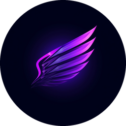

<div align="center">
   
   <h1>VioletWing</h1>
   <p>TriggerBot · ESP · Bunnyhop · NoFlash - all in one for Counter-Strike 2</p>

[](https://github.com/Jesewe/VioletWing/releases)
[](https://github.com/Jesewe/VioletWing/releases/latest/)
[](LICENSE)

</div>

---

External assistance tool for CS2. Reads game memory, draws an overlay, fires on your behalf - configurable per weapon, per key, per taste. Offsets update on startup so you stay functional after patches without touching a config file.

> [!WARNING]
> Using this in online matchmaking violates CS2's Terms of Service and will get your account VAC banned. Run it offline or in private servers - that's on you.

> [!IMPORTANT]
> Antivirus software will flag this. It reads another process's memory, which looks identical to malware from AV's perspective. Read the source, build it yourself, and add an exception if you trust what you see.

---

## 🌳 Quick Start

1. Download `VioletWing.exe` from the [**Releases**](https://github.com/Jesewe/VioletWing/releases) page.
2. Launch CS2 first, then run VioletWing **as Administrator**.
3. Configure everything through the GUI - no manual config editing needed.

> [!NOTE]
> Run CS2 in **windowed** or **borderless windowed** mode. Fullscreen exclusive breaks the overlay.

---

## 🔫 Features

### TriggerBot

Fires when your crosshair lands on an enemy. Weapon-specific delays keep it looking human - Snipers wait longer than Pistols.

- Keys: `x`, `c`, `mouse4`, `mouse5` (or toggle mode)
- Per-class delays: Pistols, Rifles, Snipers, SMGs, Heavy
- Tunable `ShotDelayMin`, `ShotDelayMax`, `PostShotDelay`

### ESP Overlay

Draws over the game window. Enemies show boxes, skeletons, snaplines, health bars, and names. Teammates optional.

- Bounding boxes, skeletons, snaplines
- Health bars and name display with Cyrillic transliteration
- Fully customizable colors and line thickness

### Bunnyhop

Auto-jumps at the right tick so you stop fighting the scroll wheel.

- Custom jump key binding
- Adjustable jump delay

### NoFlash

Caps flash opacity. Flashbangs still go off - you just stop going blind.

- Adjustable suppression strength (0–100%)

### GUI

Full desktop interface. No command line required.

- Dashboard: live status, offset version, app version
- Tabs for General, Trigger, Overlay, and Additional settings
- Integrated log viewer and FAQ
- Auto-update checking with stable/pre-release toggle

---

## 🛠️ Build from Source

```bash
git clone https://github.com/Jesewe/VioletWing.git
cd VioletWing
pip install -r requirements.txt

# PyMeow is required for the overlay - download from:
# https://github.com/qb-0/pyMeow/releases
pip install pyMeow*.zip

python main.py
```

To build a standalone `.exe`:

```bash
compile.bat
```

**Python requirement:** `>= 3.8` and `< 3.12.10`

---

## ⚙️ Configuration

All settings save to `config.json`. The GUI writes it for you, but you can edit it by hand - VioletWing picks up changes live without a restart.

Log files go to `%LOCALAPPDATA%\VioletWing\logs\`.

---

## 🔧 Troubleshooting

| Issue                             | Fix                                                                                                                                                                                                                    |
| --------------------------------- | ---------------------------------------------------------------------------------------------------------------------------------------------------------------------------------------------------------------------- |
| Failed to fetch offsets           | Check your internet connection and firewall                                                                                                                                                                            |
| Offset errors after a game update | Wait for [cs2-dumper](https://github.com/a2x/cs2-dumper) to publish new offsets                                                                                                                                        |
| Can't open `cs2.exe`              | Run VioletWing as Administrator                                                                                                                                                                                        |
| Overlay not visible               | Switch CS2 to windowed or borderless mode                                                                                                                                                                              |
| ESP overlay is a black rectangle  | NVIDIA driver bug with transparent windows - open NVIDIA Control Panel → Manage 3D Settings → set **OpenGL GDI compatibility** to **Prefer compatible** ([raylib#2932](https://github.com/raysan5/raylib/issues/2932)) |
| Bunnyhop feels inconsistent       | CS2 window must have focus; verify your jump key binding                                                                                                                                                               |
| NoFlash does nothing              | Confirm offsets loaded correctly and the feature is enabled in General settings                                                                                                                                        |

More help in the FAQ tab inside the app.

---

## 💫 Credits

- [**a2x**](https://github.com/a2x) for [cs2-dumper](https://github.com/a2x/cs2-dumper) and keeping offsets current
- All [contributors](https://github.com/Jesewe/VioletWing/graphs/contributors) who filed issues, submitted PRs, and tested builds

---

## 🔖 License

VioletWing is licensed under the **GNU General Public License v3.0**.

```diff
+ You are free to:
• Use, study, and modify the source code.
• Distribute copies and modified versions.

+ Under the following terms:
• Keep the same GPLv3 license on any derivative work.
• Make source code available when you distribute binaries.

- You are not allowed to:
• Relicense under a proprietary license.
• Distribute without source or a written offer to provide it.
```

See [LICENSE](LICENSE) for the full text.
