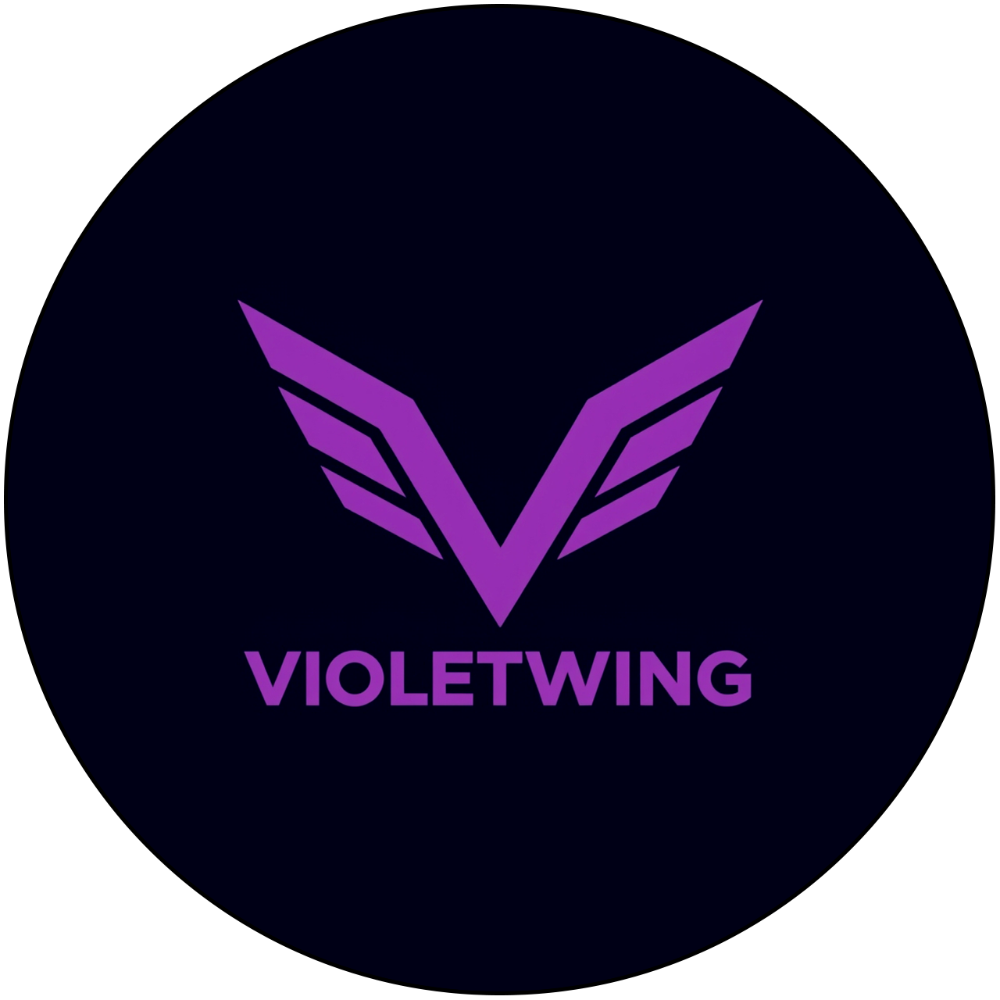

<div align="center">
   
   <h1>VioletWing</h1>
   <p>Your ultimate assistant for Counter-Strike 2</p>

[](https://github.com/Jesewe/VioletWing/releases)
[](https://github.com/Jesewe/VioletWing/releases/latest/)
[](LICENSE)

</div>

---

## What is VioletWing?

VioletWing is a training tool for Counter-Strike 2 players. It helps analyze and improve gameplay mechanics such as aim consistency, movement, and game awareness.

---

## Features

### TriggerBot

- Customizable trigger keys (`x`, `c`, `mouse4`, `mouse5`)
- Toggle mode for single-key activation
- Weapon-specific delays for Pistols, Rifles, Snipers, SMGs, and Heavy weapons
- Configurable `ShotDelayMin`, `ShotDelayMax`, and `PostShotDelay`

### ESP Overlay

- Bounding boxes, skeletons, and snaplines
- Health and name display
- Customizable colors and line thickness
- Optional teammate visualization with name transliteration

### Bunnyhop

- Configurable jump key binding
- Adjustable jump delay
- Helps practice optimal timing for speed retention

### NoFlash

- Adjustable flash suppression strength

### GUI

- Dashboard with real-time status, offset info, and version details
- Settings tabs for General, Trigger, Overlay, and Additional options
- Integrated log viewer
- Built-in FAQ
- Automatic update checking
- Supporters page

### Other

- Automatic offset updates fetched on startup
- Live config reload from `config.json` without restart
- Logs saved to `%LOCALAPPDATA%\VioletWing\logs\`
- Stable and pre-release version support

---

## Installation

### Pre-Built (Recommended)

1. Go to the [Releases Page](https://github.com/Jesewe/VioletWing/releases)
2. Download the latest `VioletWing.exe`
3. Run it

### Build from Source

```bash
git clone https://github.com/Jesewe/VioletWing.git
cd VioletWing
pip install -r requirements.txt

# Install PyMeow (required for overlay)
# Download from: https://github.com/qb-0/pyMeow/releases
pip install pyMeow*.zip

python main.py
```

To build an executable:

```bash
compile.bat
```

> System requirement: Python >= 3.8 and < 3.12.10

---

## Quick Start

1. Launch Counter-Strike 2 and enter a practice match
2. Start VioletWing
3. Configure settings via the GUI
4. Toggle features as needed

---

## Configuration

Settings can be changed through the GUI or by editing `config.json` directly. Changes to `config.json` are applied automatically via file watching.

- **General**: Enable/disable TriggerBot, Overlay, Bunnyhop, NoFlash
- **Trigger**: Activation keys, delays, weapon-specific behavior
- **Overlay**: ESP appearance, colors, display options
- **Additional**: Bunnyhop and NoFlash parameters

---

## Troubleshooting

| Issue                           | Solution                                                                      |
| ------------------------------- | ----------------------------------------------------------------------------- |
| Failed to fetch offsets         | Check internet connection and firewall settings                               |
| Offset errors after game update | Wait for updated offsets from [cs2-dumper](https://github.com/a2x/cs2-dumper) |
| Could not open `cs2.exe`        | Run with administrator privileges                                             |
| Overlay not displaying          | Use windowed or borderless mode; check overlay settings                       |
| Bunnyhop inconsistent           | Ensure CS2 window has focus; verify jump key settings                         |
| NoFlash not working             | Confirm offsets are current and feature is enabled                            |

For additional help, check the FAQ tab in the application or review logs at `%LOCALAPPDATA%\VioletWing\logs\`.

---

## Disclaimer

This tool is provided for educational and training purposes only. Using automation tools in online multiplayer matches violates Counter-Strike 2's Terms of Service and may result in VAC bans or other penalties. The developers assume no responsibility for misuse. Use at your own risk and only in appropriate contexts.

---

## License

VioletWing is licensed under the **GNU General Public License v3.0**. See the [LICENSE](LICENSE) file for details.
